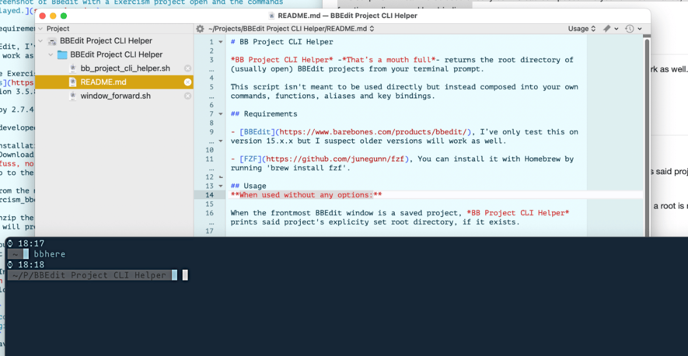
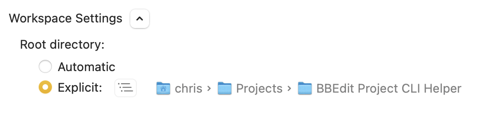

# BB Project CLI Helper

*BB Project CLI Helper* -*That’s a mouth full*- returns the root directory of (usually open) BBEdit projects from your terminal prompt.

This script isn't meant to be used directly but instead composed into your own commands, functions, aliases and key bindings.

All I wanted to do really, was run a short command to zip to my terminal to an open projects root directory. I also really wanted to mess around with fzf.



## Requirements

- [BBEdit](https://www.barebones.com/products/bbedit/), I’ve only test this on version 15.x.x but I suspect older versions will work as well.

- [FZF](https://github.com/junegunn/fzf), install it with Homebrew by running `brew install fzf`.

- I developed this on MacOS Sequoia (15.x.x).

## Installation

1. Copy to a dir accessable by the users PATH. Such as /usr/local/bin.  
  `$ cp bb_project_cli_helper.sh /usr/local/bin/bb_project_cli_helper`
1. Make the script executable.  
  `$ chmod 755 /usr/local/bin/bb_project_cli_helper`

## Usage
**When used without any options:**

When the frontmost BBEdit window is a saved project, *BB Project CLI Helper* prints said project's explicity set root directory, if it exists.

It will use the Project List in the project window to infer the root of the project when a root is not set in the projects settings.

> [!TIP]
> You can set the root on any saved project. Select the Top item in the project list, this will display a setting screen. Under Workspace Settings is the Root directory preference. Select explicit and set it.
> 

Insta-projects, which are essecially folders opened by BBEdit, will return the path to that folder, also infered from the item list.

### Available Options

- **-h:**
  Opens this help message.
- **-d:**
  Prints the working directory of frontmost open document in BBEdit instead of the project's root.
- **-a=query:**
  Will display a menu -searchable via fzf- of saved BBEdit projects. This menu will be limited projects with a set root. The selected project will return the root to the project.
- **-p=query:**
  Will return the path to the project file "*.bbprojectd" as selected by a searchable menu.
- **-a and -p:**
  Require a string as their argument which may be empty.

### Examples
Move to the root directory of an open project or the document's working directory.

```bash
  alias bbhere='cd "$(bb_project_cli_helper)" 2> /dev/null || cd "$(bb_project_cli_helper -d)" 2> /dev/null || return 1'
```

Here is a similar idea as a fish function. Go to the root directory or pass the -d option to go to the parent directory of the frontmost open file.

```fish
  function bbhere
    set -l flag
    string match -q -- '-d' $argv[1] && set flag $argv[1]
    cd (bb_project_cli_helper $flag)
  end
```

Open a BBEdit project via fzf and cd into it's root directory.

```bash
  bbopen(){
    local p_path
    p_path="$(bb_project_cli_helper -p "")" || return 0
    bbedit "$p_path" && cd "$(bb_project_cli_helper)" || return 1
  }
```

> [!NOTE]
> **Bonus Script:** Pass *window_forward* the name of a running app and it will provide you with a list of it’s open windows. Make a selection and it will set the window as the frontmost for that app. Try something like: `$ window_forward "BBEdit" && cd $(bb_project_cli_helper)`

